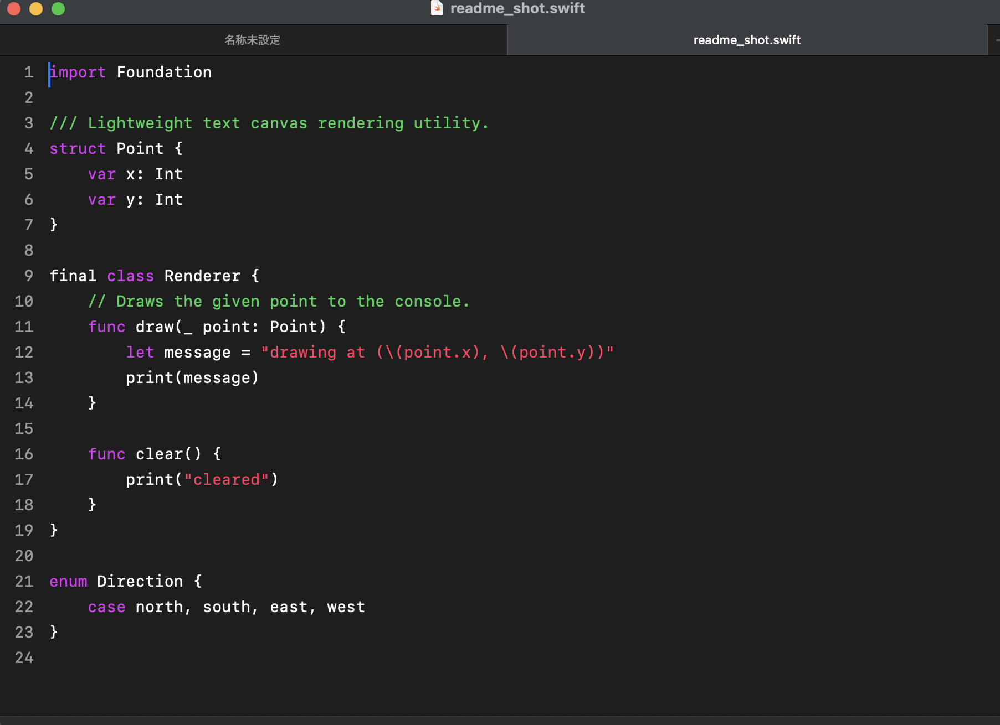

# Litepad

**軽量・高速・巨大ファイル対応**を掲げるmacOSネイティブのテキストエディタです。
Windows向けテキストエディタ「[サクラエディタ](https://github.com/sakura-editor/sakura)」の思想に着想を得て、
Swift/AppKitでゼロから実装しています(サクラエディタのソースコードは含まれていません)。



## 特徴

- **軽量・高速**: 実行ファイルは1MB未満、起動は0.1秒程度
- **巨大ファイルに強い**: mmap＋遅延読み込みにより、2.5GB超のログファイルも数秒でオープン・保存できる
- **シンタックスハイライト**: C/C++, Java, Python, SQL, COBOL, Pascal, VB, Perl, Swift, Go, Rust など20言語以上に対応
- **矩形選択・検索/正規表現置換・Grep(フォルダ内横断検索)**
- **アウトライン**: 型・関数の一覧をパネル表示し、ジャンプできる(⌘⇧O)
- **ブックマーク・行番号・自動保存とクラッシュ復元**
- **文字コード自動判定**: UTF-8 / UTF-8(BOM) / Shift_JIS / UTF-16(LE/BE)
- 非サンドボックスの直接配布を前提とした、依存の少ないシンプルな構成(Swift Package Managerのみ、Xcodeプロジェクト不要)

## 動作環境

- macOS 13 (Ventura) 以降

## インストール

### 1. ビルド済みアプリを使う

[Releases](../../releases) から最新の `Litepad.app.zip` をダウンロードして展開し、`Litepad.app` を `/Applications` などお好きな場所に移動してください。

開発元の署名(Apple公証)は行っていないため、初回起動時にmacOSのGatekeeperによってブロックされます。
以下のいずれかの方法で起動してください(初回のみ、以降は通常通りダブルクリックで起動可能です)。

**方法A: ターミナルで許可する(確実)**

```sh
xattr -cr /Applications/Litepad.app
```

**方法B: システム設定から許可する**

1. `Litepad.app` をダブルクリックすると「"Litepad"は使用がブロックされました」等の警告が出るので「完了」を選ぶ
2. システム設定 → プライバシーとセキュリティ を開き、一番下までスクロール
3. 「"Litepad"は使用がブロックされました」という項目の「このまま開く」をクリックし、パスワード/Touch IDで確認
4. もう一度確認ダイアログが出るので「開く」を選択

(macOS 13〜14では「右クリック→開く」でも起動できましたが、macOS 15 (Sequoia)以降はこのバイパスが廃止されたため、上記の方法が必要です。)

### 2. ソースからビルドする

macOSにSwiftツールチェーン(Xcode Command Line Tools)がインストールされていれば、以下で自分でビルドできます。

```sh
git clone <このリポジトリのURL>
cd Litepad
./build-app.sh
```

`~/Applications/Litepad.app` が作成され、Finder/Spotlightから起動できるようになります。

## 使い方(主なキー操作)

| 操作 | キー |
|---|---|
| 新規 / 開く / 保存 / 名前を付けて保存 | ⌘N / ⌘O / ⌘S / ⌘⇧S |
| 検索と置換 | ⌘F |
| Grep(フォルダ内検索) | ⌘⇧F |
| アウトライン | ⌘⇧O |
| ブックマークの切替 / 次へ / 前へ | ⌘F2 / F2 / ⇧F2 |
| 環境設定(フォント・タブ幅・行番号表示) | ⌘, |

矩形選択は `⌥(Option)` を押しながらドラッグします。

## 開発

テストはXCTestで書かれています(`Tests/LitepadTests`)。

```sh
swift test
```

## ライセンス

[MIT License](LICENSE)。サクラエディタ本家(zlib License)のコードは一切含まれていません。着想元としての位置づけの詳細はLICENSEファイル末尾を参照してください。
